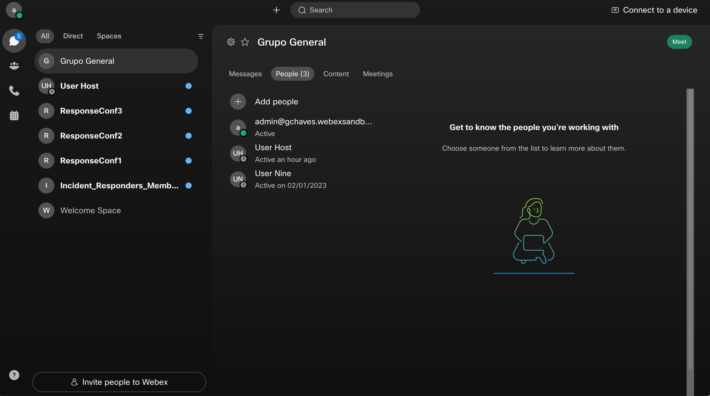
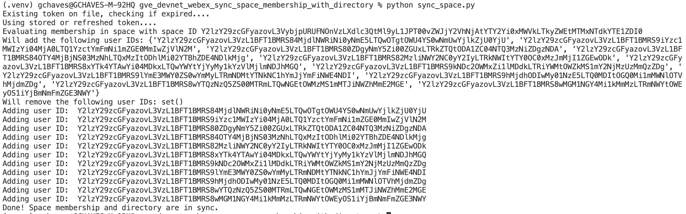
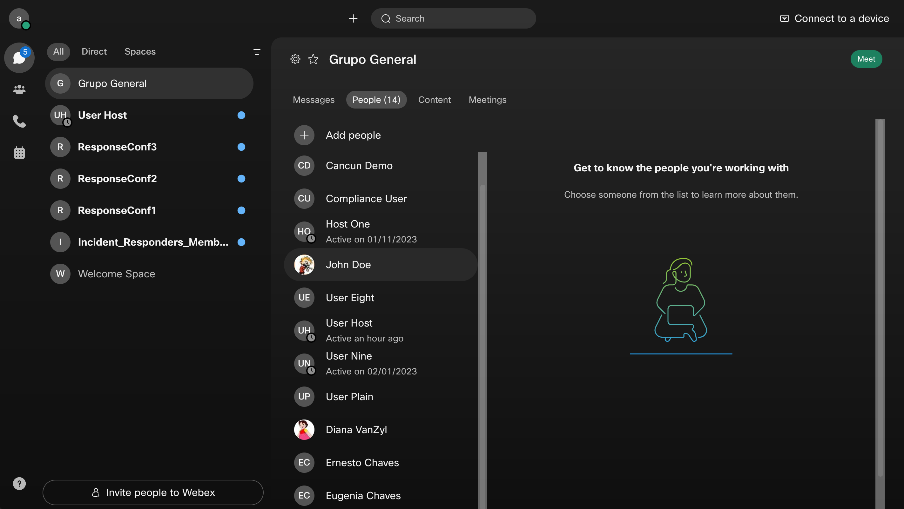

# GVE Devnet Webex Sync Space Membership with Directory

This prototype syncronizes the membership a particular Webex Space with the entire company directory following some criteria for which users to include/exclude.

It also uses an oAuth flow to capture and refresh an access token with the correct priviledges ans scopes to perform the needed operations.

## Contacts

- Gerardo Chaves (gchaves@cisco.com)

## Solution Components

- Webex Messaging

## Coding Guides used

Downgrading the requests-oauthlib library to version 1.0.0 to avoid the OAuth error I was getting:
https://github.com/requests/requests-oauthlib/issues/324

Example Oauth with Webex Teams:
https://github.com/CiscoDevNet/webex-teams-auth-sample

Walkthrough including how to refresh tokens:
https://developer.webex.com/blog/real-world-walkthrough-of-building-an-oauth-webex-integration

## Related Sandbox Environment

This sample code can be tested using any Cisco Webex organization sandbox

## Installation/Configuration

First, you need to create a webex integration in your organization to be able to authenticate users with the sample
applications so that it can access and edit the various spaces for which the user is a moderator.

Follow the instructions in the [Webex Integrations](https://developer.webex.com/docs/integrations) documentation to create
an integration with the following scopes:  
`'spark-admin:people_read', 'spark-admin:organizations_read', 'spark:memberships_read', 'spark:memberships_write'`

You might want to use the following for the redirect URI in the integration to match de defaults in the sample code:  
http://127.0.0.1:5500/callback

Clone this repository with `git clone [repository name]` or you can just download the files with the "Download Zip"
option within the green Code dropdown button and unzip them in a local directory.

Set up a Python virtual environment. Make sure Python 3 is installed in your environment, and if not,
you may download Python [here](https://www.python.org/downloads/).

Once Python 3 is installed in your environment, you can activate the virtual environment with
the instructions found [here](https://docs.python.org/3/tutorial/venv.html).

Install the sample code requirements with `pip3 install -r requirements.txt`

Now edit the .env file to fill out the following configuration variables:

**CLIENT_ID**  
Set this variable to the Client ID from your integration.

**CLIENT_SECRET**  
Set this variable to the Client Secret from your integration.

**SYNC_SPACE_ID**  
ID of the Webex space to keep membership in sync with corporate directory.

In the login.py file, configure the following variable:

**PUBLIC_URL**
Set PUBLIC_URL to the URL where your instance of this Flask application will run. If you do not change the parameters
of app.run() at the end of the server.py file, this should be the same value of 'http://127.0.0.1:5500' that is set by default
in the sample code.  
NOTE: This URL does not actually have to map to a public IP address out on the internet.

## Usage

To obtain admin token:

    $ python login.py

Once the flask app is running, a user with the role of Webex Admin for the organization has to use a web browser to
log into the base route (typically http://127.0.0.1:5500/) so that the code can generate a tokens.json file that
is stored in the same local directory where the flask application is running so that the entire list of corporate users can be accessed.
If you attempt to use the application without this step, you will get an error message indicating you should run login.py first and the script witll stop.

NOTE: You only have to use the organization admin credentials to log into /admin_login once to generate the tokens.json file. As long
as the application is used at least once in a 3 month period, the code will refresh the token as needed. If the file is deleted or
it expires beyond refresh , the application with just prompt you to have the admin log in.
Be sure to clear out the **tokens.json** file when you are done using the sample so you do not leave unsecured token credentials in some
test server. When creating production code using this sample as a reference, be sure to store in a more secure manner and fully encrypted.

Once the admin token is properly stored in the **tokens.json** , you can proceed to run the script to keep the space in sync with the directory.

Here is an example of a space that will be used to keep in sync before the script is run:

To execute the script, you can run it from the command line in the terminal like this:

    $ python sync_space.py

The script will print to console the list of user IDs it intends to add and remove from the space to keep in sync with the directory. Afterwards, it will proceed to print out the user ID for each addition or deletion it performs:

Once it is done, the space will have the correct members:

You might want to schedule the script to run on a daily basis using `cron` on Linux or any other scheduling utility on your Operating System.

### LICENSE

Provided under Cisco Sample Code License, for details see [LICENSE](LICENSE.md)

### CODE_OF_CONDUCT

Our code of conduct is available [here](CODE_OF_CONDUCT.md)

### CONTRIBUTING

See our contributing guidelines [here](CONTRIBUTING.md)

#### DISCLAIMER:

<b>Please note:</b> This script is meant for demo purposes only. All tools/ scripts in this repo are released for use "AS IS" without any warranties of any kind, including, but not limited to their installation, use, or performance. Any use of these scripts and tools is at your own risk. There is no guarantee that they have been through thorough testing in a comparable environment and we are not responsible for any damage or data loss incurred with their use.
You are responsible for reviewing and testing any scripts you run thoroughly before use in any non-testing environment.
